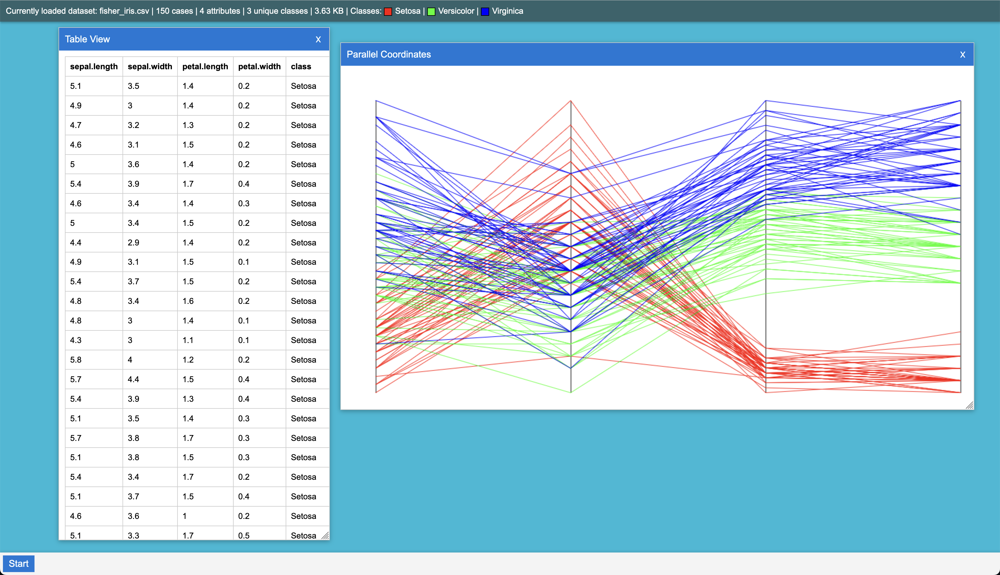
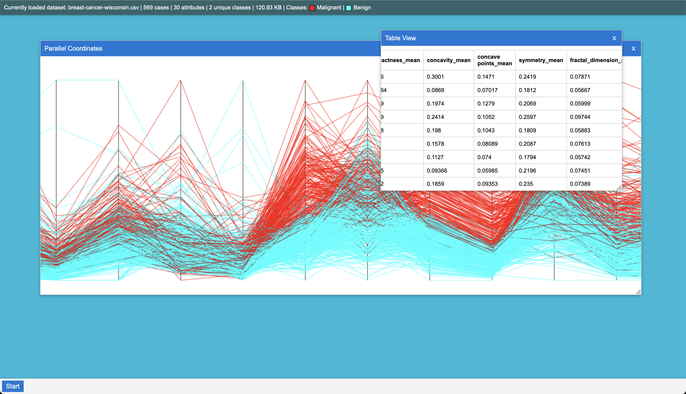

# VizDesk

[This project is currently under construction. 🚧]  
What if there was a local 🏠 desktop 🖥️ metaphor for data science 📈 and visualization 🛠️?  
Utilizing Visual Knwoledge Discovery and Machine Learning techniques developed at @CWU-VKD-LAB in a user-accessible and intuitive platform.

[Current Live Version Here (data still processed locally on your device.)](https://avaavarai.github.io/VizDesk/)

## Data Format

Data loaded must be in CSV format. First csv row is always column headers, whichever label has a header of `class` case-insensitive is denoted the label column.

## Project Setup

Want to setup the project on your local environment?

1. Download: Clone the repository.
2. Open: Open root repository folder in a terminal.
3. Install: `npm install`
4. Compile: `npx tsc`
5. Host: `http-server ./`

## License

This project is freely available for personal and commercial use under the MIT license, see `LICENSE` for details.
